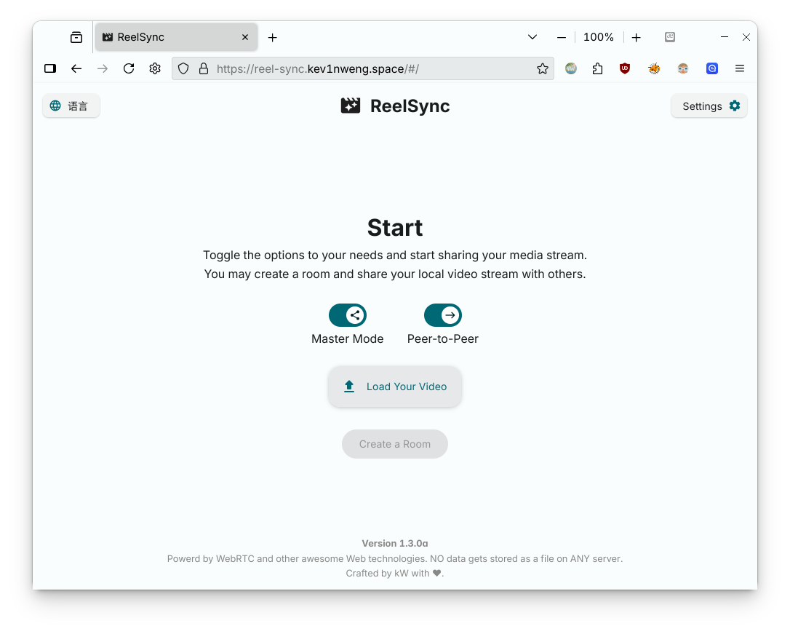

# reel-sync

**English / [简体中文](README.md)**


随时随地和另一个人同时观看一个视频 | Watch videos with someone in sync, anytime, anywhere.



As mentioned in the introduction, this is a real-time video streaming tool **based on modern Web technologies (e.g. WebRTC)**.
- With TURN/STUN servers configured, it allows users to **share local videos (or online video streams) with any other user on the Internet**, without worrying about cross-platform, cross-device, or cross-network issues.
- Due to its working principle, users do not need to register or log in, and video stream data will not be stored on the server because it is a **peer-to-peer** application.
- In the future, more features will be added, such as **screen sharing, real-time chat**, etc.

## License

The source code of this project is released under the **GPL-3.0 License**. 

> The GNU General Public License version 3 (GPL-3.0), released by the Free Software Foundation (FSF) in 2007, is a copyleft license designed to safeguard users' freedoms to run, study, share, and modify software. 
> It mandates that derivative works incorporating GPL 3.0-licensed code must adopt the same license, ensuring source code availability and preventing proprietary restrictions. 
> The license also addresses technical neutrality in digital rights management (DRM) and enhances compatibility with other open-source licenses.

For more information, please refer to the [LICENSE](LICENSE) file.

## Deployment

[](https://vercel.com/new/clone?repository-url=https://github.com/kev1nweng/reel-sync&env=VITE_NODE_SERVER_URL&env=VITE_MAX_ACCEPTABLE_DELAY_SECONDS&project-name=reel-sync&repository-name=reel-sync)⠀←⠀Click this button to deploy on Vercel (recommended), **or:**

```bash
git clone https://github.com/kev1nweng/reel-sync && cd reel-sync && npm run build && npm run preview
```

## Environment Variables

- `VITE_NODE_SERVER_URL` - Your `iceServer` server list address (Refer to Cloudflare Call for API documentation)
- `VITE_MAX_ACCEPTABLE_DELAY_SECONDS` - Maximum acceptable delay time (seconds)
- `VITE_SAME_ORIGIN_SYNC_INTERVAL_SECONDS` - Sync interval time for video progress in same-origin mode (seconds)


## Roadmap

***School is quite busy, progress may be slow. Feel free to fork and contribute.***

- [ ] Browser Compatibility
  - [x] Mozilla Firefox
    - [x] Issue with receiving but not sending due to lack of `captureStream()` support
    - [x] Homepage style issue (`padding` not displaying correctly)
  - [ ] Safari (and all browsers using Apple Webkit)
    - [ ] Issue with receiving but not sending due to lack of `captureStream()` support

- [x] Peer-to-peer mode
  - [x] WebRTC real-time video streaming
  - [ ] Screen sharing ←
  - [ ] Webcam streaming

- [ ] Same-origin mode
  - [x] WebRTC playback progress and behavior communication
  - [x] End-to-end playback progress synchronization
  - [x] Delay measurement
  - [x] Playback progress synchronization considering network delay
  - [ ] Slave node video operation requests

- [ ] Real-time chat
  - [ ] WebRTC text message transmission
  - [ ] WebRTC voice message transmission

- [ ] User settings
  - [ ] Custom settings UI
  - [ ] `localStorage API` configuration storage

- [ ] Cross-platform applications
  - [ ] Capacitor Android application
  - [ ] ~~Capacitor iOS application~~

- [ ] i18n multilingual support ←
  - [x] StartView UI (CN/EN)
  - [x] StreamView UI (CN/EN)
  - [ ] ~~msg (CN/EN)~~
  - [x] Manual switch

- [ ] Other features
  - [ ] Direct share link
  - [ ] Background image customization

## Start Developing In One Line

[VSCode](https://code.visualstudio.com/) + [Volar](https://marketplace.visualstudio.com/items?itemName=Vue.volar) (and disable Vetur) are recommended.

```bash
git clone https://github.com/kev1nweng/reel-sync && cd reel-sync && npm i
```

## Star History

[](https://www.star-history.com/#kev1nweng/reel-sync&Date)