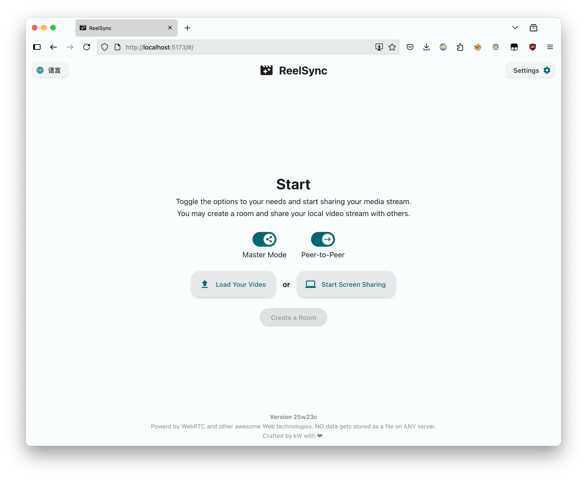

# ReelSync

**English / [简体中文](README.md)**


随时随地与他人同步观看视频或共享屏幕。无需注册，即点即用 | Watch videos in sync or share your screen with others. No signup, click and go.



ReelSync is a "share a link and it just works" watch-together / screen-sharing app built with **WebRTC and other modern Web technologies**.

Think of it as:

- **No signup, no accounts**: the link is the session.
- **Open-link experience**: hosts create a room and share the link; guests open it and join.
- **Cross-platform**: runs in modern browsers (best on desktop; mobile can join as a viewer but screen sharing is limited).
- **Peer-to-peer & privacy-first**: media is sent end-to-end over WebRTC; no server-side storage/transcoding/recording.
- **Open source (GPL-3.0)**: self-hostable and auditable.
- **Multiple sources**:
  - Local video file (P2P mode)
  - Screen sharing (P2P mode)
  - Online video URL (Same-origin mode: both sides load the same URL; only controls/progress are synced)

> [!WARNING]
> Privacy still depends on the ICE/TURN and signaling services you choose. Prefer trusted providers or self-hosting.

## Compatibility

- **Safari**: due to API limitations, P2P capture/streaming may be unavailable or unstable.
- **Firefox**: system audio during screen sharing is typically not available (browser limitation).
- **Mobile**: screen sharing is usually unavailable; joining as a viewer is supported.

## Security & privacy

- Media is sent end-to-end over WebRTC.
- In P2P mode, your video/screen stream goes directly to your peer; when needed, TURN may relay **encrypted traffic**.
- This project does not implement server-side media storage/transcoding/recording.
- Choose trusted ICE/TURN and signaling services; self-host if you need stronger guarantees.

## Deployment

[](https://vercel.com/new/clone?repository-url=https://github.com/kev1nweng/reel-sync&env=VITE_TURN_SERVER_SOURCE_URL&env=VITE_MAX_ACCEPTABLE_DELAY_SECONDS&env=VITE_LATENCY_MEASUREMENT_INTERVAL_SECONDS&env=VITE_SAME_ORIGIN_SYNC_INTERVAL_SECONDS&env=VITE_ADSENSE_ACCOUNT&project-name=reel-sync&repository-name=reel-sync)⠀←⠀Click this button to deploy on Vercel (recommended), **or:**

Self-hosting (static hosting) best practice:

- Build the project in CI or locally.
- Deploy the `dist/` directory to any static hosting (Nginx / Caddy / GitHub Pages / Cloudflare Pages, etc.).

```bash
git clone https://github.com/kev1nweng/reel-sync && cd reel-sync && pnpm i && pnpm build
```

## Environment Variables

> [!Warning]
> In same-origin mode, video playback synchronization has high network requirements; high network latency may cause frequent forced synchronization.
> If a stable network environment cannot be guaranteed, please increase the maximum acceptable latency (at least 1 second).

This project follows Vite env var conventions. Recommended workflow:

1. Copy `.env.example` to `.env`
2. Adjust values as needed

- `VITE_TURN_SERVER_SOURCE_URL`: API endpoint returning ICE servers (TURN/STUN). The response format is similar to Cloudflare Realtime Kit.
  - It is only used to fetch `iceServers` config; media is not uploaded via this endpoint.
- `VITE_MAX_ACCEPTABLE_DELAY_SECONDS`: max allowed drift in Same-origin mode (seconds) before forced resync.
- `VITE_LATENCY_MEASUREMENT_INTERVAL_SECONDS`: RTT measurement interval in P2P mode (seconds).
- `VITE_SAME_ORIGIN_SYNC_INTERVAL_SECONDS`: progress sync interval in Same-origin mode (seconds).
- `VITE_ADSENSE_ACCOUNT` (optional): inject AdSense meta into `index.html`.

## License

The source code of this project is released under the **GPL-3.0 License**.

> The GNU General Public License version 3 (GPL-3.0), released by the Free Software Foundation (FSF) in 2007, is a copyleft license designed to safeguard users' freedoms to run, study, share, and modify software.
> It mandates that derivative works incorporating GPL 3.0-licensed code must adopt the same license, ensuring source code availability and preventing proprietary restrictions.
> The license also addresses technical neutrality in digital rights management (DRM) and enhances compatibility with other open-source licenses.

For more information, please refer to the [LICENSE](LICENSE) file.

## Development

[VSCode](https://code.visualstudio.com/) + [Volar](https://marketplace.visualstudio.com/items?itemName=Vue.volar) (disable Vetur) are recommended.

Install dependencies:

```bash
git clone https://github.com/kev1nweng/reel-sync
cd reel-sync
pnpm i
```

Start the dev server:

```bash
pnpm dev
```

Build:

```bash
pnpm build
```

## Star History

[](https://www.star-history.com/#kev1nweng/reel-sync&type=date&legend=top-left)
