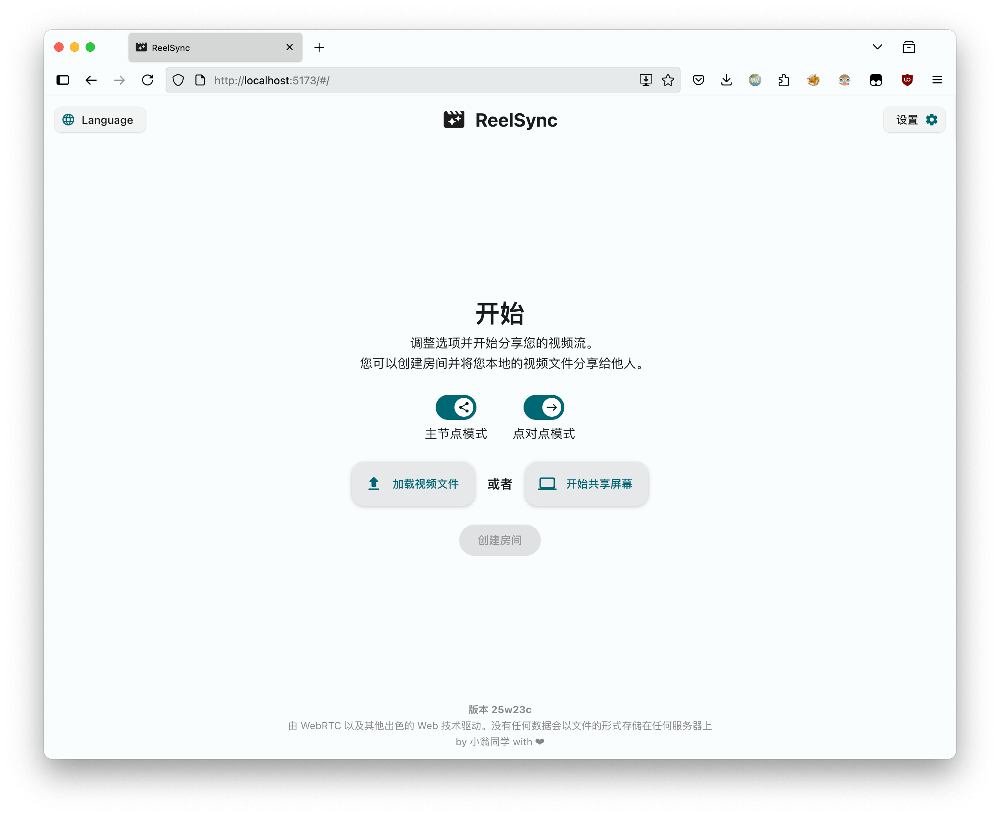

# ReelSync

**简体中文 / [English](README.en.md)**


随时随地与他人同步观看视频或共享屏幕。无需注册，即点即用。 | Watch videos in sync or share your screen with others. No signup, click and go.



ReelSync 是一个同步观影 / 屏幕共享工具，基于 **WebRTC 以及其它现代 Web 技术**。

核心特点如下：

- **无需注册登录**：链接就是会话。
- **分享直链，打开即加入**：房主创建房间并分享链接；访客打开链接即可加入（支持 `/?join=ROOM_ID`）。
- **跨平台**：运行于现代浏览器（桌面体验最佳；移动端可加入观看但屏幕共享受限）。
- **点对点、隐私优先**：媒体通过 WebRTC 端到端传输；不做服务端存储 / 转码 / 录制。
- **开源（GPL-3.0）**：可自部署、可审计。
- **多种来源**：
  - 本地视频文件（点对点模式）
  - 屏幕共享（点对点模式）
  - 在线视频 URL（同源模式：双方加载同一 URL，仅同步控制与进度）

> 隐私与安全边界仍取决于你所选择的 ICE/TURN 与信令服务。若有更强保障诉求，建议自建或选择可信服务。

## 与其他类似项目相比的特点

很多“同步观影”工具要么要求注册账户、要么依赖中心化播放服务器、要么绑定特定平台播放器。ReelSync 更聚焦于：

- **链接即房间**：分享一次，随开随用。
- **两种互补模式**：
  - **点对点模式**：把本地视频或屏幕直接推给对方。
  - **同源模式**：不传输媒体流，只同步播放行为（当双方都能访问同一 URL 时更省带宽）。
- **隐私优先的工程取舍**：不做服务端媒体留存与处理。

## 部署

[](https://vercel.com/new/clone?repository-url=https://github.com/kev1nweng/reel-sync&env=VITE_TURN_SERVER_SOURCE_URL&env=VITE_MAX_ACCEPTABLE_DELAY_SECONDS&env=VITE_LATENCY_MEASUREMENT_INTERVAL_SECONDS&env=VITE_SAME_ORIGIN_SYNC_INTERVAL_SECONDS&env=VITE_ADSENSE_ACCOUNT&project-name=reel-sync&repository-name=reel-sync)⠀←⠀点击这个按钮部署到 Vercel（推荐），**或者：**

自部署（静态托管）的最佳实践：

- 在本地或 CI 中执行构建产物生成。
- 将 `dist/` 目录部署到任意静态托管（Nginx / Caddy / GitHub Pages / Cloudflare Pages 等）。

```bash
git clone https://github.com/kev1nweng/reel-sync && cd reel-sync && pnpm i && pnpm build
```

## 环境变量

> [!Warning]
> 同源模式下，视频播放进度同步对网络的要求较高；较高的网络延迟可能导致频繁的强制同步。
> 若无法保证良好的网络环境，请将最大可接受延迟时间调高一些（至少 1 秒钟）。

- `VITE_TURN_SERVER_SOURCE_URL` - 你的 ICE/TURN（STUN）服务器列表地址（响应格式参考 Cloudflare Realtime Kit）
- `VITE_MAX_ACCEPTABLE_DELAY_SECONDS` - 最大可接受延迟时间（秒）
- `VITE_LATENCY_MEASUREMENT_INTERVAL_SECONDS` - RTT 延迟测量间隔时间（秒）
- `VITE_SAME_ORIGIN_SYNC_INTERVAL_SECONDS` - 同源模式下视频进度同步间隔时间（秒）
- `VITE_ADSENSE_ACCOUNT`（可选）- 构建时向 `index.html` 注入 AdSense meta

本项目遵循 Vite 环境变量约定。推荐流程：

1. 复制 `.env.example` 为 `.env`
2. 按需修改

## 浏览器 / 平台说明

- **Safari**：受 API 限制，点对点采集/推流可能不可用或不稳定。
- **Firefox**：屏幕共享的“系统音频”通常不可用（浏览器限制）。
- **移动端**：通常不支持屏幕共享；可作为观看端加入。

## 安全与隐私

- 媒体通过 WebRTC 端到端传输。
- 点对点模式下，你的视频/屏幕流会直连对方；必要时 TURN 会中继**加密后的流量**。
- 本项目不实现服务端媒体存储 / 转码 / 录制。
- 请谨慎选择 ICE/TURN 与信令服务；如需更强保障建议自建。

## 许可证

该项目在 **GPL-3.0 许可证** 下发布。

> GNU 通用公共许可证第三版（GPL-3.0）是由自由软件基金会（FSF）于2007年发布的自由软件许可证，旨在保障用户运行、研究、共享及修改软件的自由。
> 其核心条款基于 Copyleft 机制，要求任何使用或分发 GPL-3.0 授权代码的衍生作品必须采用相同许可证公开源码，以防止专有软件对自由软件的限制。
> 该协议还强化了对数字版权管理（DRM）的技术中立性约束，并提升了与其他开源许可证的兼容性。

有关更多信息，请参阅 [LICENSE](LICENSE) 文件。

## 一行命令开始开发

推荐使用 [VSCode](https://code.visualstudio.com/) + [Volar](https://marketplace.visualstudio.com/items?itemName=Vue.volar) (禁用 Vetur).

```bash
git clone https://github.com/kev1nweng/reel-sync && cd reel-sync && (command -v pnpm >/dev/null 2>&1 && pnpm i && pnpm dev || (npm i && npm run dev))
```

## 星标历史记录

[](https://www.star-history.com/#kev1nweng/reel-sync&type=date&legend=top-left)
